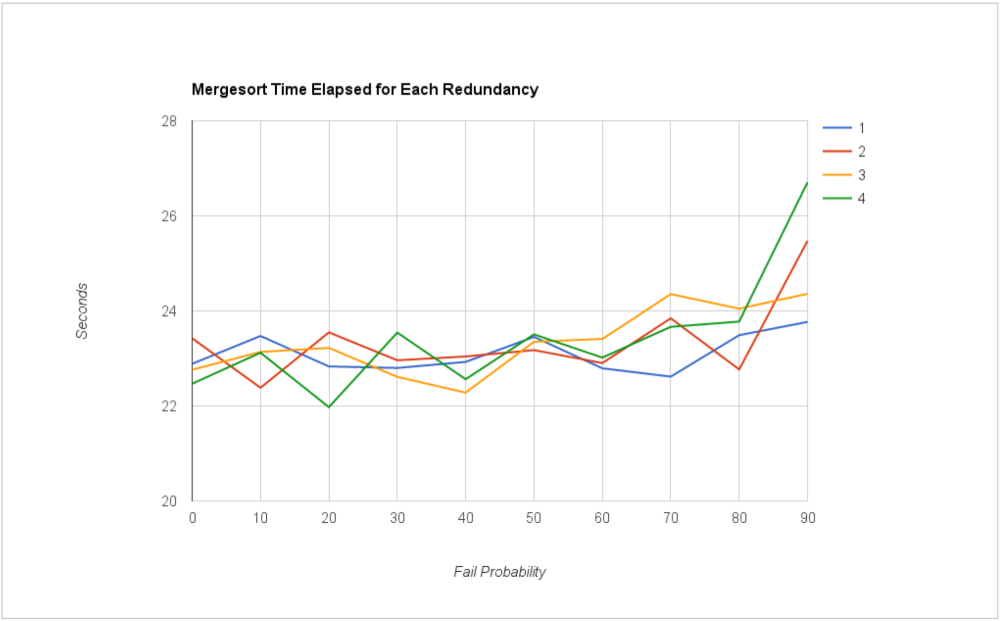

# Evaluation

The evaluation was done on a data set generated under the following
conditions:

- Four worker servers running on different hosts each.
- The input file used was the one with 10 million numbers (approx 48 MB).
- The chunk size used was 1,000,000 bytes.
- The chunks per merge used was 8 chunks.
- Four values were used for the redundancy (number of concurrent requests for
  proactive failure tolerance). r = 1, 2, 3, 4.
- Ten values were used for the failure probability. These were 0%, 10%, 20%,
  30%, 40%, 50%, 60%, 70%, 80%, and 90%.

## Plots

I plotted the average time elapsed for each mergesort in the graph below:

## Conclusion

Honestly speaking, I don't understand the results I got. The time elapsed
does increase significantly from 80% to 90%, but aside from that, the values
are roughly the same at all failure probabilities. Because of variability
in each line, it's difficult to tell what redundancy setting is better where.

What I would do for a more in-depth evaluation would be to add more data points
at each redundancy/failure probability setting, since right now it has 2 data
points, and that leaves it vulnerable to things like a busy network. Also, there
is the possibility that 4 workers isn't a good number for these settings, so I
would try a few different sizes of the worker fleet. Finally, I picked redundancy
vs failure probability because they were the most interesting from a distrubuted
systems standpoint, but chunk size, chunks per merge, and fleet size are all
potentially interesting parameters to vary.

Overall, the system was implemented quite well, albeit with confusing final results
that can be attributed to lack of depth in the evaluation.
